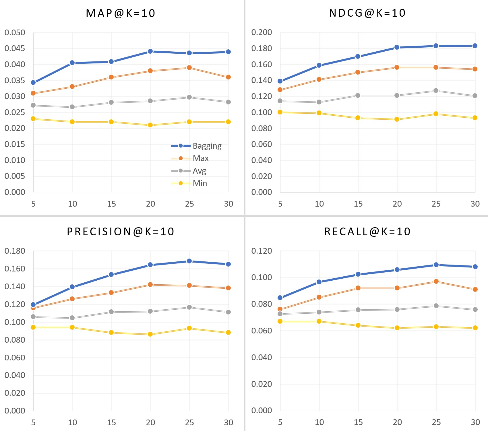

# Ensemble of Recommendation Algorithm
PySpark implementation of Bagging Ensemble for recommendation systems

## Prerequisite
* Basic knowledge on [recommender systems](https://en.wikipedia.org/wiki/Recommender_system).
* pySpark

## How It Works and Why
[Bagging](https://en.wikipedia.org/wiki/Bootstrap_aggregating) (Bootstrap aggregating) is
a machine learning (ML) ensemble method designed to improve the stability and accuracy of
ML algorithms used in statistical classification and regression. 

One of the most successful application of Bagging is [Random Forest](https://en.wikipedia.org/wiki/Random_forest).

The method implemented here uses the exact same approach as the conventional Bagging ensemble:
1. Train *M* recommender models (base models) with bootstrapping of a training set

2. To predict item ratings, generate *M* predictions by using the base models and then average
the predicted ratings for each item

3. For recommending top *k* items, on the other hand, generate *M* recommendation lists of *k* items
with the base models, combine the list.

Currently, this repo implements three combining methods `average`, `sum`, and `count`.

For more details about how to use the module, see the [example notebook](./als_bagging_on_movielens.ipynb)
which utilizes multiple [ALS](https://spark.apache.org/docs/latest/api/python/pyspark.ml.html#module-pyspark.ml.recommendation)
for movie recommendation

## Results
Performance metrics on MovieLens 100k dataset
* x-axis: Number of base-models generated
* Max: Max value yielded by the base-models
* Min: Min value yielded by the base-models
* Avg: Averaged values of the base-model outcomes
* Bagging: Ensemble results of the base-models

